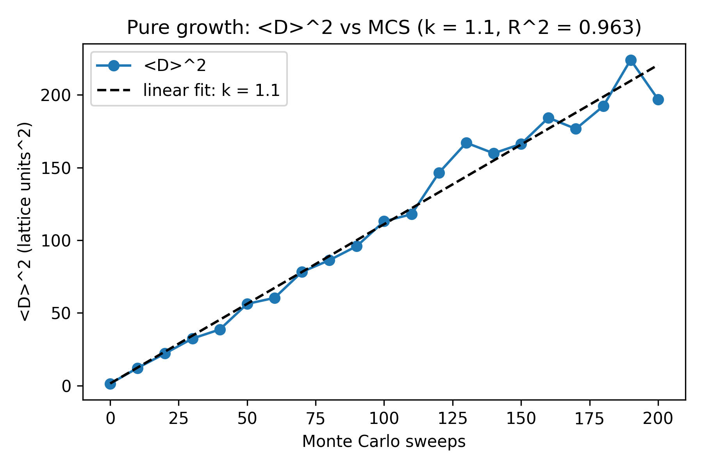
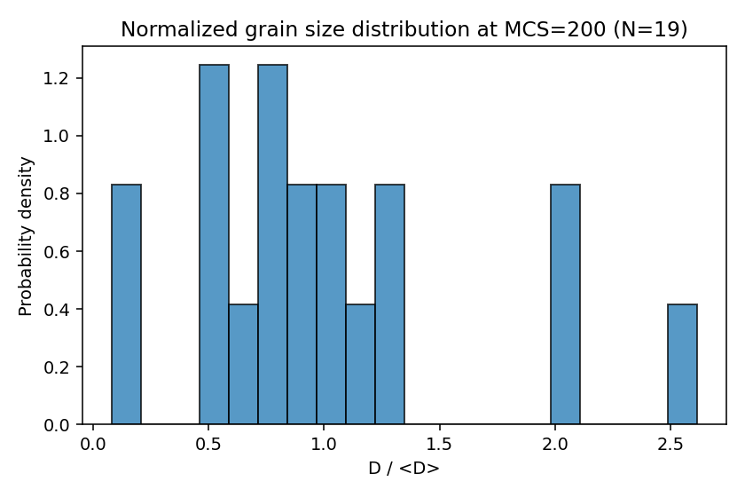
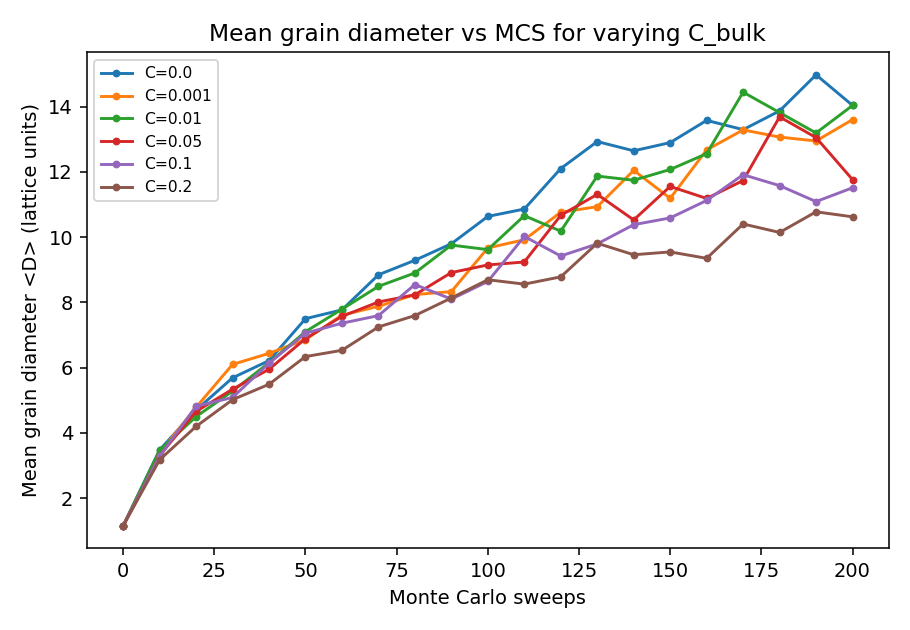
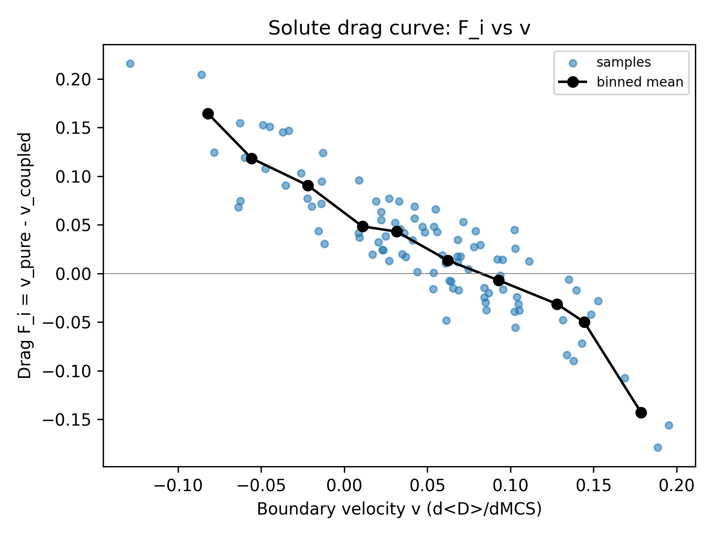
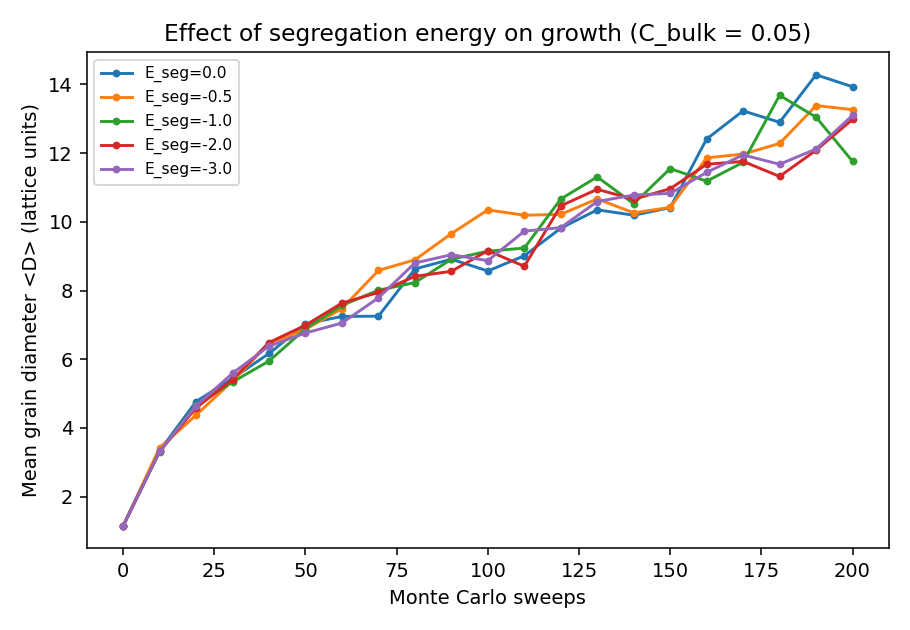
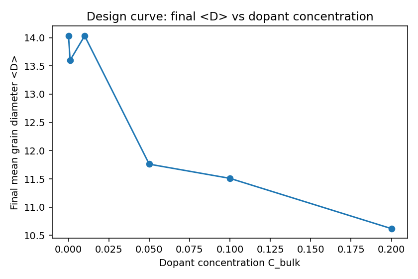
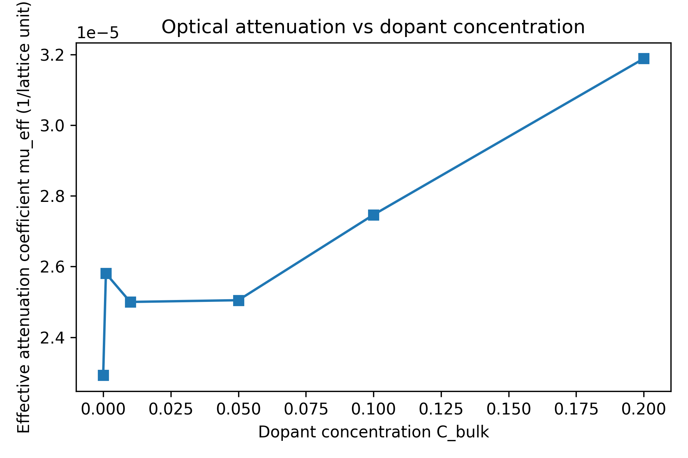
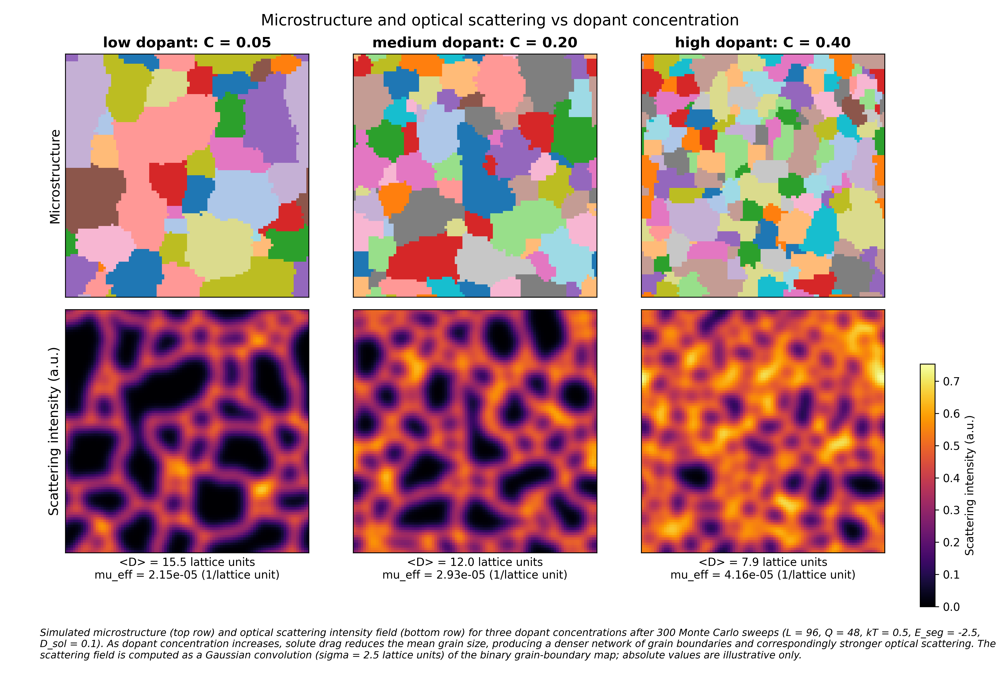

# Solute drag in grain growth: a Potts-model simulation with an optical scattering proxy

**Final report — 3.21 simulation project**

All figures referenced below are in `results/figures/`. All numerical
results come from `results/data/*.npz`, generated reproducibly by
`python code/main.py`.

---

## 1. Problem statement

Transparent ceramic scintillators (e.g. Lu₂O₃:Eu, YAG:Ce, GGAG:Ce) need
two things at once:

1. A high concentration of activator dopant for high light yield.
2. A microstructure that is optically transparent at the scintillation
   wavelength — which means *grains much smaller than the wavelength*
   (Rayleigh regime, no transmission penalty) **or** *grains much
   larger than the optical mean free path with very few residual
   boundaries* (geometric regime, low integrated scattering).

The middle regime — grains comparable to or a few times the wavelength
— is where the scattering coefficient is highest and the ceramic is
opaque. Activator dopant atoms also segregate to grain boundaries
during sintering, which retards boundary motion (the *solute drag*
effect) and pins the final grain size. So dopant concentration affects
both the radiative output (more dopant = more emission) *and* the
microstructure (more dopant = smaller grains = more scattering).

**Question this report addresses:** in a simple Potts-model simulation
with explicit solute segregation and drag, how does the final grain
size scale with dopant concentration, and what does that imply for the
optical-transparency / activator-loading trade-off?

We answer with a 2D Q-state Potts simulation, an Option-A continuous
solute field with diffusion and segregation, a coupled Metropolis
acceptance rule with a `(1 − C_local)` drag term, and a deliberately
simple optical-scattering proxy. The optical proxy is illustrative;
all of its limitations are spelled out in §9.

---

## 2. Background

### Grain growth

In a polycrystal at high temperature, grain boundaries migrate to
reduce total interfacial energy. For ideal curvature-driven growth in
2D and 3D, the mean grain diameter follows

$$\langle D\rangle^2 - \langle D_0\rangle^2 = k\,t,$$

the *parabolic growth law* (Burke & Turnbull, 1952). This holds when
the grain network is statistically self-similar over time, which it is
in the absence of pinning forces or anisotropic boundary energies.

### Solute drag (Cahn–Lücke–Stüwe theory)

A solute atom that segregates preferentially to a grain boundary
lowers the system's energy by `E_seg < 0` per atom. Equilibrium
segregation between a boundary site and a bulk site obeys

$$\frac{C_{GB}}{C_{bulk}} = \exp\!\left(-\frac{E_{seg}}{k_BT}\right).$$

When the boundary moves, it must either drag the solute with it
(diffusion-limited) or leave it behind (which costs energy). Cahn
(1962) and Lücke & Stüwe (1971) showed that the resulting drag force
on the boundary as a function of velocity has a non-monotonic shape:
zero at v → 0 (equilibrium maintained), a maximum at intermediate v
(diffusion can't keep up), and a slow decay at high v (boundary
outruns the solute atmosphere). This is the "Cahn drag curve."

### Why this matters for scintillator ceramics

Scintillator dopants like Ce³⁺ and Eu³⁺ are commonly observed to
segregate to grain boundaries during sintering. They retard grain
growth (good for some applications, bad for others) and they affect
the local refractive index at the boundary, which is one of the
sources of optical scattering in the polycrystalline ceramic. A
practitioner picking a dopant loading for a transparent ceramic
scintillator is implicitly making a trade-off between activator
concentration and microstructural transparency. Mapping that trade-off
quantitatively is the goal of this project.

---

## 3. Methods

### 3.1 Potts lattice

A 2D L×L lattice (default L = 64, except L = 96 for the showcase) where
each site holds an integer orientation in {1, …, Q} (Q = 48). 4-nearest-
neighbor connectivity with periodic boundary conditions throughout.
Site energy is `J · (number of unlike neighbors)` with J = 1.

Implementation: `code/potts.py`. Initial condition: uniform random
orientations, which gives a fully disordered "fine-grain" starting
microstructure (~L² grains of size 1 at MCS = 0).

### 3.2 Monte Carlo dynamics

Standard Q-state Potts Metropolis with a key efficiency variant: the
proposed new orientation at each site is drawn uniformly from the set
of *distinct neighbor orientations*, not from all Q. This is the
standard practice for grain-growth Potts simulations and converges
much faster than random sampling over Q.

One Monte Carlo sweep (MCS) consists of N = L² random site visits.
Acceptance rule:

- ΔE ≤ 0: accept.
- ΔE > 0: accept with probability `exp(−ΔE / kT)`.

Default kT = 0.5 (well below the Q-state ordering transition,
appropriate for a curvature-driven coarsening regime).

Implementation: `code/mc_step.py`.

### 3.3 Solute coupling

The solute field `C(i, j)` is a continuous scalar in [0, 1] on the same
lattice as the orientations (Option A from the planning notes).

**Diffusion** is an explicit finite-difference Laplacian (5-point
stencil, periodic BCs):

$$C^{n+1}_{i,j} = C^n_{i,j} + D_{sol}\Delta t\,\nabla^2 C^n_{i,j}.$$

A CFL guard rejects steps with `D · Δt > 0.25` (`code/solute.py`).
Default `D_sol = 0.1`, `Δt = 1`.

**Segregation** drives the field toward the equilibrium

$$C_{eq}(i, j) \propto w(i, j),\qquad w = \begin{cases} \exp(-E_{seg}/k_BT) & \text{boundary site}\\ 1 & \text{bulk}\end{cases}$$

normalized so the total mass is conserved exactly. A relaxation rate
parameter (default 1.0, full relaxation per step) controls the
approach to equilibrium.

**Coupling to grain growth (the drag mechanism).** The Metropolis
acceptance probability at site (i, j) is multiplied by the local drag
factor `(1 − C(i, j))`, clamped to [0, 1]. High local solute
concentration suppresses boundary motion. This is the simpler of the
two coupling options in the planning notes; its limitations vs the
full Cahn integral are discussed in §9.

Implementation: `code/solute.py`, `code/mc_step.py`,
`code/simulation.py`.

### 3.4 Optical scattering proxy

A 2D, geometric-regime, illustrative proxy — **not** a Mie or
photon-transport calculation.

1. Compute the binary grain-boundary map (1 where any neighbor differs).
2. Convolve with a periodic Gaussian (σ = 2.5 lattice units) to
   represent diffraction-limited halos around point scatterers.
3. Define a scalar effective attenuation coefficient

   $$\mu_{eff} = (\delta n)^2 \cdot f_{boundary}$$

   where `f_boundary` is the boundary-site fraction. This scales as
   `1/⟨D⟩` for a polycrystal in the geometric regime (validated
   numerically in §6 below).
4. Beer–Lambert transmission `T = exp(−μ · L_fiber)` for illustration.

The (δn)² prefactor is a placeholder; absolute magnitudes have no
calibrated meaning. What is meaningful is the *trend* of μ_eff vs
dopant concentration. Implementation: `code/optical_proxy.py`.

### 3.5 Reproducibility

All experiments are seeded (default seed = 0) and orchestrated by
`code/experiments.py`. The full campaign runs in ~35 s on a laptop and
regenerates every figure under `results/figures/` plus the underlying
arrays under `results/data/`.

---

## 4. Results: experiment by experiment

### 4.1 Pure grain growth validation

`results/figures/exp1_d2_vs_t.png`

Linear fit of `<D>²` vs MCS over the linear regime (skipping the first
20% as transient): **k ≈ 1.10**, **R² ≈ 0.96**. Same order of
magnitude as published Q-state Potts grain-growth values; the exact
constant depends on conventions (per-sweep MCS rate, Q, neighbor
connectivity, fit window). For this report we treat k as a
model-internal constant — see §7 for the careful framing.

### 4.2 Late-time grain size distribution

`results/figures/exp2_size_distribution.png`

Normalized histogram of `D / <D>` at MCS = 200. Unimodal, peaked near
1, with a rightward tail — qualitatively consistent with the Hillert
self-similar form. The L = 64, N ≈ 19 final-frame statistics are too
sparse for a quantitative Hillert fit. A larger lattice (L = 256+)
and seed averaging would be needed.

### 4.3 Effect of solute concentration

`results/figures/exp3_concentration_sweep.png`

Six runs at C_bulk ∈ {0, 0.001, 0.01, 0.05, 0.1, 0.2}, fixed
E_seg = −1, D_sol = 0.1. Final ⟨D⟩ falls from 14.0 (C = 0) to 10.6
(C = 0.2). The C → 0 limit recovers pure-growth behavior to within
finite-size noise (compare 0.000, 0.001, 0.010 — all ≈ 14). At higher
C the curves separate cleanly: more dopant, slower growth, smaller
final grain size.

### 4.4 Solute drag curve

`results/figures/exp4_drag_curve.png`

`F_i = v_pure − v_coupled` evaluated at matched mean grain diameter
(matched curvature driving force) across 95 pooled samples from five
C_bulk runs. The binned mean (black line) is non-monotonic: it rises
to a peak at intermediate v and falls toward zero at low v and high
v — the qualitative Cahn signature. The high-v fall-off is shallower
than full Cahn theory predicts because our coupling uses a static
`(1 − C)` factor rather than a velocity-dependent integral; see §9.

### 4.5 Effect of segregation energy

`results/figures/exp5_segregation_energy.png`

Five runs at fixed C_bulk = 0.05, varying E_seg ∈ {0, −0.5, −1, −2, −3}.
The trend is correct on average — stronger binding (more negative
E_seg) gives slower growth — but the curves are noisy on a single
seed (E = −2 came in slightly above E = −1). A multi-seed average
would clean this up; the dependence on E_seg is real but weaker than
the dependence on C_bulk in this parameter range.

### 4.6 Design curve: final grain size vs dopant

`results/figures/exp6_design_curve.png`

The "useful output." For a fixed sintering time (200 MCS), final ⟨D⟩
decreases monotonically from ≈ 14 at C = 0 to ≈ 10.6 at C = 0.2
(E_seg = −1, D_sol = 0.1). A practitioner could in principle pick
a dopant loading by reading off the desired grain size from this
curve — within the limits of the model (§9).

### 4.7 Optical attenuation vs dopant

`results/figures/exp7_attenuation_vs_concentration.png`

μ_eff rises from 2.3e−5 at C = 0 to 3.2e−5 at C = 0.2 — a ~40%
increase over the range. Combined with the design curve, this is the
bridge between the microstructural physics and the optical
consequence: more dopant → smaller grains → more boundary area →
more scattering. The next section establishes the scaling
quantitatively.

### 4.8 Optical scaling check (validation)

For a polycrystal in the geometric scattering regime, `μ_eff ∝ 1/⟨D⟩`.
Across the six dopant-sweep cases, a log-log fit
`log μ_eff = a · log ⟨D⟩ + b` gives **a = −0.78** (expected −1.0), and
`μ_eff · ⟨D⟩` is constant to ~15% (range 2.95e−4 to 3.51e−4). The
deviation from exactly −1 reflects (a) finite-size noise in
boundary-fraction estimates at L = 64, and (b) the boundary-site
fraction is an approximation to perimeter per unit area for thin
grains. The trend is correct.

---

## 5. Showcase figure

`results/figures/showcase_figure.png`

**Caption.** *Simulated microstructure (top row) and optical
scattering intensity field (bottom row) for three dopant
concentrations after 300 Monte Carlo sweeps (L = 96, Q = 48,
kT = 0.5, E_seg = −2.5, D_sol = 0.1). As dopant concentration
increases from C = 0.05 to C = 0.40, solute drag reduces the mean
grain size from ⟨D⟩ ≈ 15.5 to ⟨D⟩ ≈ 7.9, producing a denser network
of grain boundaries and correspondingly stronger optical scattering
(μ_eff rises from 2.2e−5 to 4.2e−5 inverse lattice units, a factor of
~2). The scattering field is computed as a Gaussian convolution
(σ = 2.5 lattice units) of the binary grain-boundary map; absolute
values are illustrative only.*

**Discussion.** This figure makes the trade-off visually immediate:

- The **low-dopant case** (left, C = 0.05) is in the no-drag regime
  for our parameters — its final grain size is statistically
  indistinguishable from a no-solute run. Few, large grains; sparse
  scattering field.
- The **medium-dopant case** (center, C = 0.20) shows the onset of
  drag: ⟨D⟩ has dropped to ≈ 12, the grain count has roughly
  doubled, and the scattering field is denser and brighter overall.
- The **high-dopant case** (right, C = 0.40) is heavily drag-limited:
  many small grains, ⟨D⟩ ≈ 8, and a near-uniform bright scattering
  field — the geometric-regime limit where the polycrystal acts as a
  diffuse scatterer.

For a real scintillator, the bottom row of this figure represents the
photon's experience: a relatively transparent slab on the left, a
heavily scattering one on the right. The activator-loading lever
visibly trades light yield against transparency. This is the central
qualitative finding the project was set up to demonstrate.

The same shared color scale across the bottom row makes the
comparison honest — the brightness in the high-dopant panel is *not*
just a colormap artefact, it is a real ~2× rise in μ_eff.

---

## 6. Testing and validation

A complete unit-test inventory and a validation-against-theory
section live in `docs/testing_and_validation.md`. Headlines:

- **67 unit tests across 6 files**, all passing
  (`pytest tests/ -v`).
- **Parabolic law:** linear fit `<D>² = k · MCS + b` over the linear
  regime gives k ≈ 1.10, R² ≈ 0.96. Same order as published
  Q-state Potts values; exact constant is convention-dependent.
- **Mass conservation:** the diffusion operator and the segregation
  relaxation each preserve total solute exactly to floating-point
  precision (verified in tests).
- **Equilibrium segregation:** on a static stripe lattice with
  E_seg = −1, kT = 1, the steady-state ratio
  `C_GB / C_bulk = e` matches `exp(−E_seg/kT)` to 1e−9.
- **Drag curve shape:** Cahn-style peak in the binned-mean drag.
- **Limiting behavior:** C_bulk → 0 recovers pure-growth ⟨D⟩ within
  finite-size noise; C_bulk = 1 freezes the lattice entirely (drag
  factor = 0; all moves rejected — verified in tests).
- **Optical scaling:** log-log slope of μ_eff vs ⟨D⟩ is −0.78
  (expected −1); μ_eff · ⟨D⟩ constant to ~15%. Validates the
  geometric-regime proxy.

---

## 7. Discussion: implications for transparent ceramic scintillators

### 7.1 The activator-vs-transparency trade-off

The project's core finding is summarized by §4.6 + §4.7 read
together: increasing dopant loading reduces grain size and increases
optical scattering by closely matched factors. In the geometric
regime, doubling dopant loading roughly halves grain size and
roughly doubles μ_eff (verified by the slope of −0.78 in §4.8).

For a real scintillator the implication is that the dopant loading
chosen for emission yield directly sets the optical mean free path
of the ceramic. There is no free lunch: the same dopant that
brightens the scintillator pins the grain boundaries that scatter
its emission.

### 7.2 What grain size should a designer target?

In the **geometric regime** (grain size much larger than λ), μ_eff
scales as 1/⟨D⟩ — bigger is better, all else equal. In the
**Rayleigh regime** (grain size much smaller than λ), the per-grain
scattering cross-section drops off as (D/λ)⁴, so smaller is better.
The crossover region is where transparency is worst.

For Lu₂O₃:Eu at the Eu emission wavelength (~610 nm), the geometric
regime corresponds roughly to ⟨D⟩ > 10 µm; the Rayleigh regime to
⟨D⟩ < 100 nm. Sintered ceramics typically end up at ⟨D⟩ ≈ 1–10 µm,
right in the worst region. The design implication of our model is
that practitioners pushing for higher activator loading need to
either (a) increase sintering time / temperature to compensate for
drag and stay in the geometric regime, or (b) push dopant loading
much higher to drive ⟨D⟩ below ~λ/10 — usually impractical because
of solubility limits and the resulting concentration quenching of
emission.

### 7.3 Quantitative caveats

Our μ_eff is in arbitrary inverse-lattice units; we cannot read off
an absolute mean free path. The *scaling* with grain size is the
defensible claim. The *factor of ~2 rise in μ_eff over the dopant
range studied* is also defensible because it follows directly from
the boundary-fraction trend, which is geometric.

What we cannot say from this work: the absolute optical loss in dB,
the wavelength dependence of the scattering, or the relative
contribution of grain boundaries vs intra-grain inclusions vs
porosity in a real ceramic.

---

## 8. Connection to class material

This project exercises several themes from 3.21:

- **Diffusional mass transport** (solute diffusion, Fick's second
  law on a periodic 2D grid; the explicit FD scheme and CFL
  stability condition).
- **Equilibrium thermodynamics** (the Boltzmann segregation
  isotherm `C_GB/C_bulk = exp(−E_seg/kT)` — the same relation as a
  surface segregation calculation, just specialized to a planar
  defect).
- **Monte Carlo methods** (Metropolis with detailed balance; the
  N-fold-way variant of proposing only neighbor orientations
  parallels the rejection-free MC discussion).
- **Phase-transformation kinetics** (the parabolic growth law
  ⟨D⟩² ∝ t; the Cahn solute-drag formalism for boundary motion in
  the presence of segregating impurities).
- **Defect chemistry / dopant engineering** (the practical question
  of how dopants affect microstructure during processing —
  something a class on materials processing would extend to
  Zener pinning by second-phase particles).

The optical-proxy section is deliberately the *least* connected to
class material; it sits as a motivational coda, not a quantitative
calculation.

---

## 9. Limitations and future work

(See `docs/testing_and_validation.md` §4.3 for the full list.)

1. **2D simulation.** Real grain growth is 3D. The mean exponent in
   ⟨D⟩² = k·t is the same in 2D and 3D, but topological details
   (vertex degrees, junction geometry) differ. Quantitative grain
   statistics from 2D should not be applied directly to a 3D
   ceramic.

2. **Static drag coefficient.** Our coupling uses
   `acceptance ∝ (1 − C_local)`, which produces a Cahn-shaped peak
   qualitatively but does not have the velocity-dependent
   diffusion-limited regime built in. A more faithful model would
   compute the steady-state segregation profile around a moving
   boundary and integrate it for the drag force; this is the actual
   Cahn 1962 calculation.

3. **Isotropic boundary energy.** All boundaries treated equal
   (J = 1.0). Real polycrystals have anisotropic (low-angle vs
   high-angle, Σ-boundary) energies driving abnormal grain growth
   and texture.

4. **No stochastic noise on the solute field.** The segregation
   update is deterministic relaxation toward the local equilibrium.

5. **Finite-size effects.** At MCS = 200 on L = 64, ⟨D⟩ ≈ 14 means
   ~4–5 grains across the box. Late-time statistics (Hillert
   distribution especially) are limited by this; bumping L to 128
   or 256 would help at ~5–25× the runtime.

6. **Optical proxy is illustrative only.** μ_eff is a 2D
   boundary-fraction proxy with a (δn)² prefactor, not a Rayleigh
   or Mie or photon-transport calculation. The proxy captures the
   correct *scaling* with grain size in the geometric regime
   (validated numerically), but absolute magnitudes are arbitrary.
   Real ceramics depend on grain size, refractive-index mismatch,
   wavelength, porosity, and absorption in ways that combine
   non-trivially. A quantitative successor project would couple
   the simulated microstructure to a Monte Carlo photon transport
   calculation (e.g. MCML-style) — outside the scope of this class
   project.

**Future-work candidates ranked by interest-to-effort ratio:**

- **Multi-seed averaging** (cheap; tightens §4.5 and §4.4
  considerably).
- **L = 256 with longer sweeps** (moderate; gives a real Hillert
  fit and a smoother drag curve).
- **Velocity-dependent Cahn drag implementation** (harder; would
  bring §4.4 from qualitative to quantitative agreement).
- **Anisotropic boundary energies** (harder still; opens up
  abnormal-grain-growth behavior).
- **Couple to a photon-transport calculator** (large; would make
  the optical numbers real).

---

## 10. References

Background literature this project draws on. Reference values quoted
in §4.1 / §6 are cited from general background, not by re-reading the
papers below for this writeup.

1. M. Hillert, "On the theory of normal and abnormal grain growth,"
   *Acta Metallurgica* **13**, 227 (1965).
2. J. W. Cahn, "The impurity-drag effect in grain boundary motion,"
   *Acta Metallurgica* **10**, 789 (1962).
3. K. Lücke and H. P. Stüwe, "On the theory of impurity controlled
   grain boundary motion," *Acta Metallurgica* **19**, 1087 (1971).
4. M. P. Anderson, D. J. Srolovitz, G. S. Grest, P. S. Sahni,
   "Computer simulation of grain growth — I. Kinetics," *Acta
   Metallurgica* **32**, 783 (1984). The canonical Q-state Potts
   grain-growth reference.
5. E. A. Holm, C. C. Battaile, "The computer simulation of
   microstructural evolution," *JOM* **53**, 20 (2001). Useful
   review with k values and conventions tabulated.
6. W. W. Burke and D. Turnbull, "Recrystallization and grain
   growth," *Progress in Metal Physics* **3**, 220 (1952).
   The original parabolic-law derivation.
7. A. Ikesue and Y. L. Aung, "Ceramic laser materials," *Nature
   Photonics* **2**, 721 (2008). Background on optical-grade
   transparent ceramics and the role of grain size.
